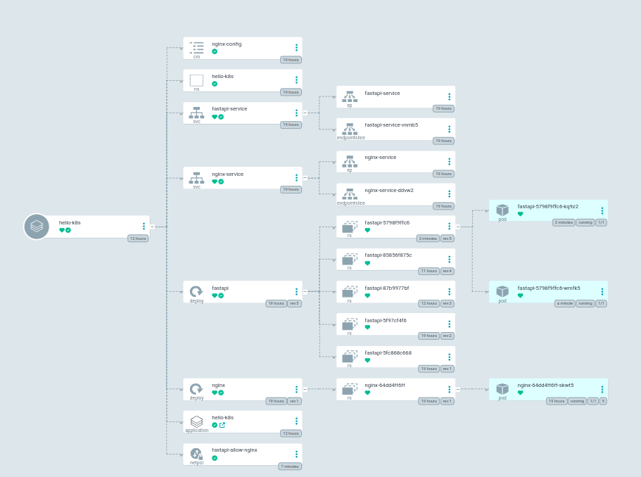

# hello-k8s

> [!NOTE]
> This project was built for learning and practicing Kubernetes concepts. 

A Kubernetes project that serves a simple REST API (`GET /` : `{"message": "hello k8s!"}`) using FastAPI behind an Nginx reverse proxy, with a CI/CD pipeline and GitOps deployment via Argo CD.

## Architecture

```
Internet
   │
   ▼
nginx-service (NodePort)
  port: 30080 → targetPort: 80
   │
   ▼
nginx Pod  ×1  (nginx:alpine)
  listens on :80
  reverse proxy → http://fastapi-service:80
   │
   ▼
fastapi-service (ClusterIP)
  port: 80 → targetPort: 8000
   │
   ▼
fastapi Pod  ×2  (ghcr.io/brkcvlk/hello-k8s-fastapi:{{Github-SHA}})
  listens on :8000
  /         → {"message": "hello k8s!"}
  /health   → liveness probe
  /ready    → readiness probe
```
### Example Argo CD application view : K8s objects and their relationships in the hello-k8s namespace



## Prerequisites

- [minikube](https://minikube.sigs.k8s.io/)
- [kubectl](https://kubernetes.io/docs/tasks/tools/)
- [Argo CD](https://argo-cd.readthedocs.io/)

## Quick start

### 1. Start the Cluster

```bash
minikube start --cpus=2 --memory=4096
```

> [!NOTE]
> If kubectl is not installed, you can use it via minikube.
>> Set an alias: 
>>>`alias kubectl="minikube kubectl --"` or use `minikube kubectl --` directly.

### 2. Setup ArgoCD

```bash
kubectl create namespace argocd
kubectl apply -n argocd --server-side --force-conflicts \
  -f https://raw.githubusercontent.com/argoproj/argo-cd/v2.13.3/manifests/install.yaml
kubectl get pods -n argocd
```

Access the Argo CD UI : `argocd-server` is ClusterIP, minikube opens a tunnel:
```bash
minikube service argocd-server -n argocd --url
```

Retrieve the initial admin password:
```bash
kubectl -n argocd get secret argocd-initial-admin-secret \
  -o jsonpath="{.data.password}" | base64 -d
```

Connect to repository
```bash
argocd login <argocd-url> --username admin --password <password> --insecure

argocd repo add https://github.com/brkcvlk/hello-k8s \
  --username brkcvlk \
  --password <github-pat>
```

### 3. Apply Manifests
```bash
kubectl apply -f manifests/namespace.yml
kubectl apply -f manifests/
minikube service nginx-service -n hello-k8s --url
```


## Endpoints

| Endpoint | Probe | Description |
|---|---|---|
| `GET /` | — | Returns `{"message": "hello k8s!"}` |
| `GET /health` | liveness | Process is alive |
| `GET /ready` | readiness | App is ready to serve traffic |

